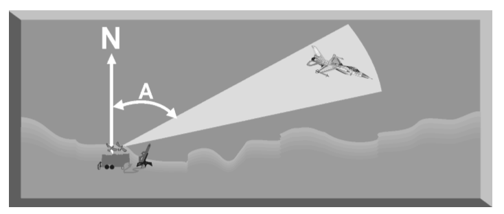

  

In Electronic Warfare (EW) systems, estimation of Angle of Arrival (AoA) of threat radar signal is an important operational functionality. In a dense radar threat scenario,multiple radar signals of various types, which are operating over multiple frequency range and impinging from all over the sphere pose threat for survivability of host Aircraft. The scenario poses challenges in all the three domains, Viz. Time, frequency and spatial. In this Internship project Amplitude comparision method for AoA estimation is explored. Various practical considerations, implementation aspects and simulation studies has been undertaken from a practical perspective.

📘 ["Download detailed internship report here"](../files/Internship_Report.pdf)

🔗 ["Github repo link"](https://github.com/Pk8598/DoA-Algorithm)
